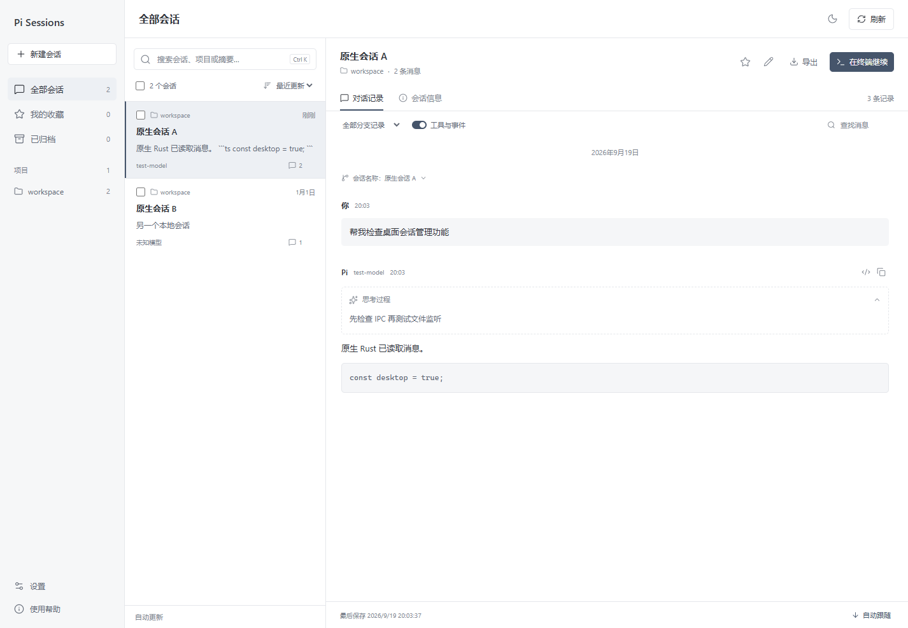
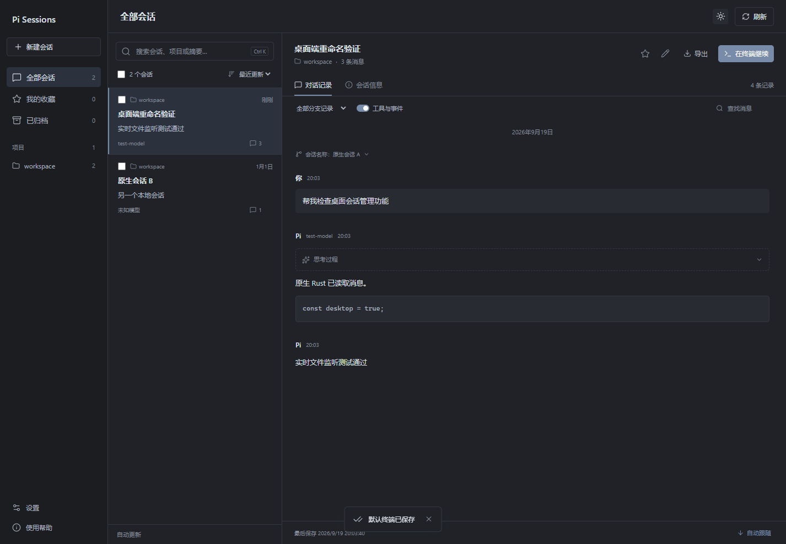

<p align="center">
  
</p>

[English](README.md) | [简体中文](README.zh-CN.md)

# Pi Sessions

<p align="center">桌面端 Pi 会话管理器，用于搜索、收藏、归档、导出并在终端继续本地 JSONL 会话。</p>

## 功能

| 目标     | 支持内容                                                      |
| -------- | ------------------------------------------------------------- |
| 查找会话 | 按名称、项目、模型、ID 和消息摘要搜索，按工作目录分组。       |
| 管理会话 | 收藏、归档、恢复，以及单个或批量重命名。                      |
| 继续工作 | 使用 pi 的 `--session` 恢复，或使用 `--fork` 分叉后继续。     |
| 查看记录 | 查看 Markdown、代码、思考过程、工具调用、执行结果和分支记录。 |
| 保持同步 | 监听本地 JSONL 变化，自动更新列表和当前详情。                 |
| 导出记录 | 通过系统保存对话框导出单个 JSONL 或多会话 JSON 包。           |

管理器只把名称、收藏和归档状态保存在自己的 SQLite 数据库中，不会为了这些操作改写原始 JSONL。恢复会话时，名称通过 pi 的命令行参数传递。

关闭主窗口后，Pi Sessions 会隐藏到系统托盘并继续同步会话。左键单击托盘图标、在右键菜单中选择“显示主窗口”，或再次启动程序，都可以恢复窗口。需要真正退出时，请右键单击托盘图标并选择“退出”。macOS 使用菜单栏图标，不显示 Dock 图标。Linux 桌面需要支持 AppIndicator 的托盘；由于 Linux 不支持托盘点击事件，请通过托盘菜单恢复窗口。

## 界面预览

<p align="center">
  
  
</p>

## 安装与快速开始

### 使用发行包

从 [GitHub Releases](https://github.com/awoaCrim/pi-session-manager/releases) 下载对应平台的安装包。Windows 需要 Microsoft Edge WebView2 Runtime。启动 Pi Sessions 后，应用会读取 pi 的默认会话目录。

`v0.1.1` 提供 Windows x64 安装包和免安装程序，包含关闭到托盘功能，并已通过 Windows 原生桌面测试。本次未构建 macOS/Linux 安装包；对应平台仍可下载 `v0.1.0` 的 DMG 和 DEB/AppImage，但旧版不包含此次托盘更新。macOS/Linux 的原生交互测试仍待实机验证。

### 从源码启动

需要 Node.js 22.12 或更高版本和 Rust stable。Windows 还需要 C++ 构建工具与 WebView2，Linux 需要 Tauri 的 WebKitGTK 系统依赖，macOS 需要 Xcode Command Line Tools。

```bash
npm install
```

```bash
npm run dev
```

使用合成数据启动演示模式。演示模式不会读取真实会话，也不会启动真实终端：

```bash
npm run demo
```

## 常用配置

应用默认读取 pi 的会话目录，也可以在“设置”中选择自定义目录。选择结果保存在管理器自己的 SQLite 数据库中。

环境变量优先级如下：

1. `PI_CODING_AGENT_SESSION_DIR`
2. `PI_CODING_AGENT_DIR` 推导出的会话目录
3. pi 的默认用户目录

Windows 默认优先使用 PowerShell 7，未检测到时回退到 Windows PowerShell。可以在“设置 → 默认终端”中选择已检测到的终端；“分叉后继续”使用 pi 的 `--fork`，避免两个进程同时写入同一个会话。

Linux 终端可以通过 `PI_SESSION_MANAGER_TERMINAL` 指定，默认使用 `x-terminal-emulator`，并要求终端支持 `-e` 参数。`PI_SESSION_MANAGER_PI_BIN` 可以指定 pi 命令名或完整路径。

导出功能使用系统保存对话框。导出的文件可能包含源码、终端输出和凭据，请妥善保存。会话文件按块扫描，不会因为整文件超过 256 MiB 而拒绝读取；单条记录、文本内容和单次详情预览仍有边界，避免把整个会话一次性载入内存。

| 环境变量                      | 用途                                                      |
| ----------------------------- | --------------------------------------------------------- |
| `PI_CODING_AGENT_SESSION_DIR` | pi 会话根目录。                                           |
| `PI_CODING_AGENT_DIR`         | pi 配置目录，用于推导默认会话目录。                       |
| `PI_SESSION_MANAGER_DATA_DIR` | 管理器 SQLite 数据目录。                                  |
| `PI_SESSION_MANAGER_PI_BIN`   | pi 命令名或完整可执行路径，默认 `pi`。                    |
| `PI_SESSION_MANAGER_TERMINAL` | Linux 终端程序，默认 `x-terminal-emulator`，需支持 `-e`。 |

## 开发与验证

构建界面：

```bash
npm run build:renderer
```

运行 Rust 单元测试：

```bash
npm test
```

检查 TypeScript：

```bash
npm run typecheck
```

检查格式：

```bash
npm run format:check
```

构建 Windows 程序和 NSIS 安装包：

```bash
npm run build
```

构建 macOS DMG：

```bash
npm run build:macos
```

构建 Linux DEB 和 AppImage：

```bash
npm run build:linux
```

先构建使用独立应用标识的 Windows 测试程序，避免与已安装的应用共用单实例锁和窗口状态：

```bash
npm run build:e2e
```

运行 Windows 原生桌面测试：

```bash
npm run test:e2e
```

桌面测试需要 Windows WebView2，会使用临时会话目录和测试用的 pi 脚本，不会修改真实 pi 会话。托盘测试会发送原生 Windows 关闭和托盘通知，根据真实托盘菜单分发菜单命令，并验证后台同步、窗口恢复和正常退出。

## 许可证

本项目采用 [MIT License](LICENSE) 授权。

## 致谢

感谢 [Linux.do](https://linux.do/)。

_本文件基于 [README.md](README.md) 在 commit `0f63627` 中的内容翻译，并同步了 `v0.1.1` 的托盘功能与发行说明。如果两份文件存在差异，以英文版本为准。_
